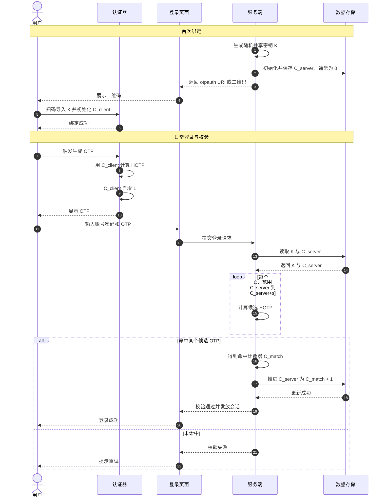

# HOTP 工作原理

本文沉淀 HOTP（HMAC-based One-Time Password，基于 HMAC 的一次性密码）的核心原理，并给出从“密钥下发”到“验证码校验与计数器推进”的完整流程。

## 1. 核心要素
- `K`：共享密钥（种子），由服务端生成并与用户绑定。
- `C`：事件计数器（Counter），每生成或成功校验一次会推进。
- `Digits`：验证码位数（常见 `6` 位）。
- `H`：哈希算法（RFC 4226 标准为 `SHA-1`）。

## 2. 生成公式
1. 将计数器 `C` 转为 8 字节大端整数。
2. 计算摘要：`HS = HMAC(H, K, C)`
3. 动态截断（Dynamic Truncation）：
   - `offset = low4bits(HS[lastByte])`
   - `P = HS[offset : offset+4]`
   - `Snum = P & 0x7fffffff`（得到 31-bit 正整数）
4. 计算 OTP：`OTP = Snum mod 10^Digits`
5. 左侧补零到固定长度（例如 `6` 位）

标准表达式：`HOTP(K, C) = Truncate(HMAC-SHA-1(K, C)) mod 10^Digits`

## 3. 详细时序图（Mermaid）

## 4. 校验侧最佳实践
- 成功后务必推进服务端计数器，防止 OTP 重放。
- 仅允许有限前瞻窗口（如 `s=10`），平衡容错与安全。
- 对失败尝试做限流与锁定，降低暴力猜测风险。
- 使用常量时间比较，减少时序侧信道风险。
- 对“计数器漂移过大”提供安全的重新同步流程。

## 5. 与 TOTP 的关系
- HOTP 基于“事件计数器”，每次事件触发都推进计数器。
- TOTP 可视为将 HOTP 的 `Counter` 替换为“时间片计数器”后的变种。
