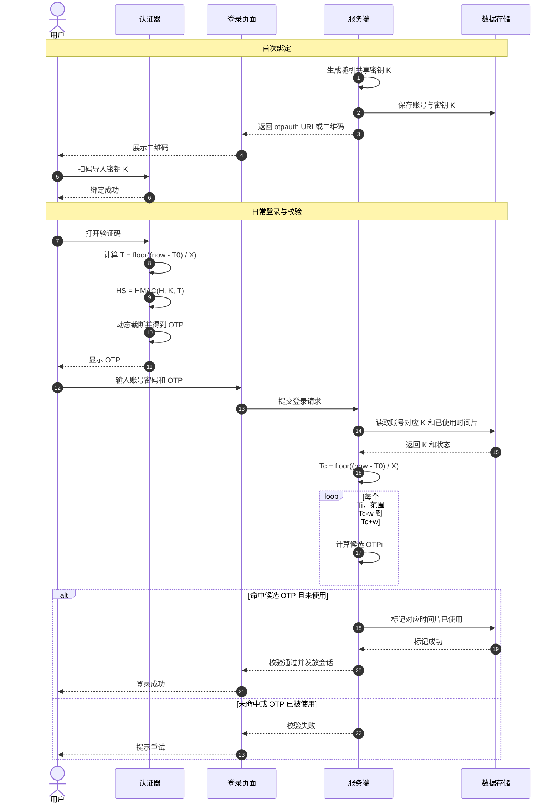

# TOTP 工作原理

本文沉淀 TOTP（Time-based One-Time Password，基于时间的一次性密码）的核心原理，并给出从“密钥下发”到“验证码校验”的完整流程。

## 1. 核心要素
- `K`：共享密钥（种子），由服务端生成并与用户绑定。
- `X`：时间步长（默认 `30s`）。
- `T0`：起始时间戳（通常为 `0`，即 Unix Epoch）。
- `Digits`：验证码位数（常见 `6` 位）。
- `H`：哈希算法（RFC 6238 常见 `SHA-1`，也可 `SHA-256/SHA-512`）。

## 2. 生成公式
1. 计算时间计数器：`T = floor((CurrentUnixTime - T0) / X)`
2. 将 `T` 转为 8 字节大端整数：`C`
3. 计算摘要：`HS = HMAC(H, K, C)`
4. 动态截断（Dynamic Truncation）：
   - `offset = low4bits(HS[lastByte])`
   - `P = HS[offset : offset+4]`
   - `Snum = P & 0x7fffffff`（去掉符号位，得到 31-bit 正整数）
5. 计算 OTP：`OTP = Snum mod 10^Digits`
6. 左侧补零到固定长度（例如 `6` 位）

## 3. 详细时序图（Mermaid）

## 4. 校验侧最佳实践
- 使用常量时间比较，避免时序攻击。
- 配置合理时间窗口（如 `±1`），平衡容错与安全。
- 启用防重放（记录已成功使用的时间片或 OTP 哈希）。
- 强制服务器时间同步（NTP），避免大范围时钟漂移。
- 对失败次数做限流/锁定策略，防止暴力猜测。

## 5. 与 HOTP 的关系
- [HOTP](hotp-workflow.md) 基于事件计数器递增。
- TOTP 可视为 `Counter = 时间片` 的 HOTP 变种，更适合无状态输入场景（如登录验证码）。
